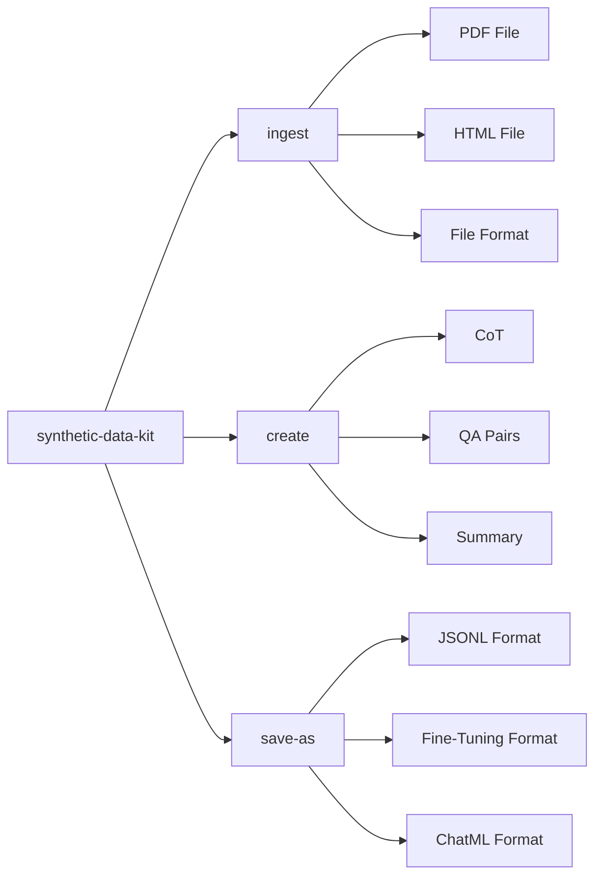

```mermaid
graph LR
    SDK[synthetic-data-kit] --> Ingest[ingest]
    SDK --> Create[create]
    SDK --> SaveAs[save-as]
    
    Ingest --> PDFFile[PDF File]
    Ingest --> HTMLFile[HTML File]
    Ingest --> YouTubeURL[File Format]

    
    Create --> CoT[CoT]
    Create --> QA[QA Pairs]
    Create --> Summary[Summary]
    
    
    SaveAs --> JSONL[JSONL Format]
    SaveAs --> FT[Fine-Tuning Format]
    SaveAs --> ChatML[ChatML Format]
```
