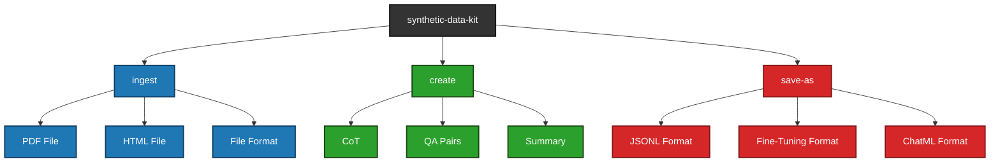

```mermaid
graph TD
    classDef sdk fill:#333,color:#fff,stroke:#111,stroke-width:2px;
    classDef ingestBranch fill:#1f77b4,color:#fff,stroke:#0e3c61,stroke-width:2px;
    classDef createBranch fill:#2ca02c,color:#fff,stroke:#1a4314,stroke-width:2px;
    classDef saveasBranch fill:#d62728,color:#fff,stroke:#801515,stroke-width:2px;

    SDK[synthetic-data-kit]
    
    SDK --> Ingest[ingest]
    SDK --> Create[create]
    SDK --> SaveAs[save-as]
    
    Ingest --> PDFFile[PDF File]
    Ingest --> HTMLFile[HTML File]
    Ingest --> YouTubeURL[File Format]

    Create --> CoT[CoT]
    Create --> QA[QA Pairs]
    Create --> Summary[Summary]

    SaveAs --> JSONL[JSONL Format]
    SaveAs --> FT[Fine-Tuning Format]
    SaveAs --> ChatML[ChatML Format]

    class SDK sdk;
    class Ingest,PDFFile,HTMLFile,YouTubeURL ingestBranch;
    class Create,CoT,QA,Summary createBranch;
    class SaveAs,JSONL,FT,ChatML saveasBranch;


```
